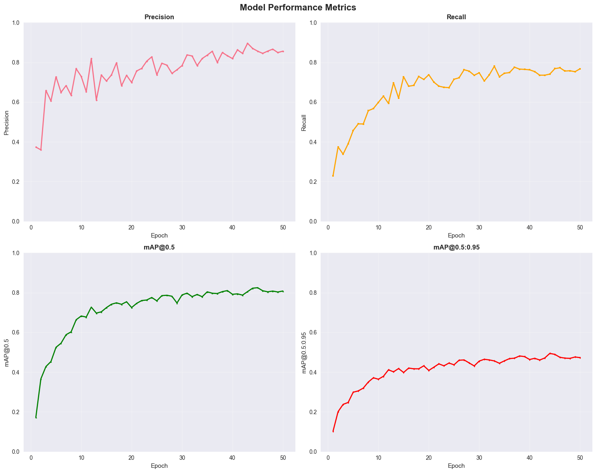
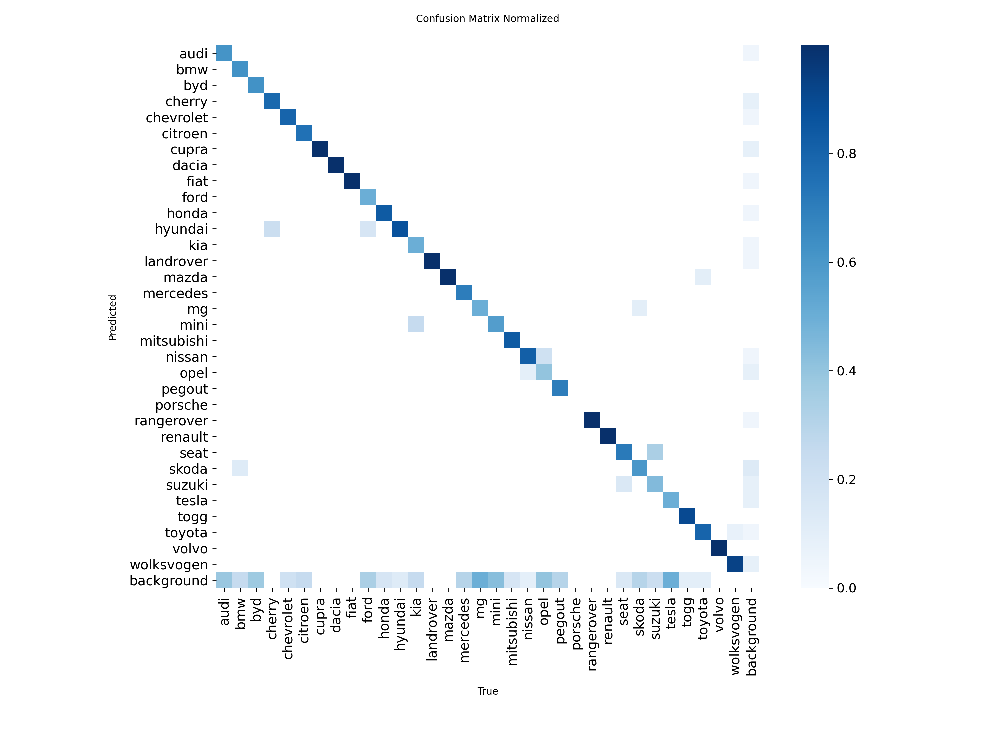
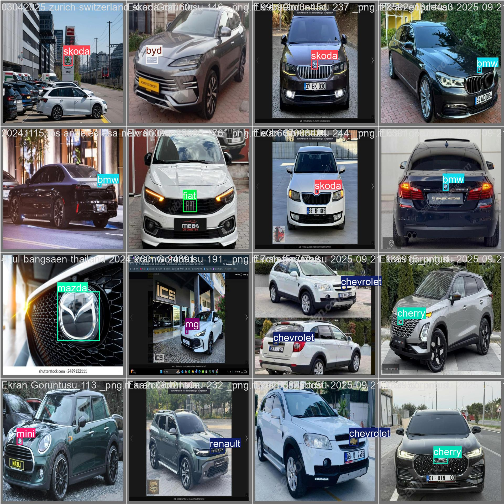
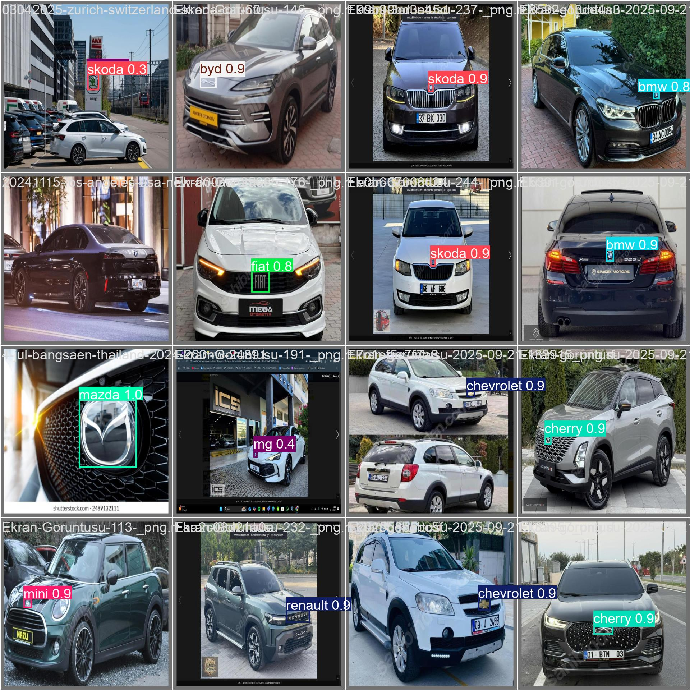

# 🔍 Brand Eye - AI-Powered Hybrid Brand Detection Suite

**A comprehensive hybrid YOLO+MobileNet brand detection system with professional GUI applications for real-world deployment.**

## 🌟 Complete Solution Overview

Brand Eye combines cutting-edge hybrid AI architecture (YOLO+MobileNet) with intuitive PyQt6 GUI applications, providing a complete brand recognition solution from training to deployment.

**🎯 Core Components:**
- **Hybrid Model**: YOLOv8 + MobileNetV2 backbone for optimal speed/accuracy balance
- **Image GUI**: Professional single-image analysis application  
- **Video GUI**: Advanced video processing with smart object tracking
- **GPU Acceleration**: Automatic CUDA optimization for maximum performance

---

**Key Advantages:**
- **⚡ Speed**: MobileNetV2 backbone provides 2-3x faster inference
- **🎯 Accuracy**: YOLO detection head maintains precision
- **💾 Efficiency**: Reduced model size for deployment
- **📱 Mobile-Ready**: Optimized for edge computing
- **🔄 Flexibility**: Easy backbone swapping capability

---

## � Quick Start Guide

### 📦 Installation

1. **Clone Repository**
```bash
git clone https://github.com/haydarkadioglu/brand-eye
cd brand-eye
```

2. **Automated Setup** (Recommended)
```bash
python setup.py
```

3. **Manual Setup**
```bash
python -m venv .venv
.venv\Scripts\activate  # Windows
# source .venv/bin/activate  # Linux/macOS
pip install -r requirements.txt
```

### 🎮 Launch Applications


**Command Line:**
```bash
python main_gui.py    # Image GUI
python video_gui.py   # Video GUI
```

### 📁 Model Setup
Place your trained YOLO model at:
```
model/best.pt
```

---

## 💻 System Requirements

**Minimum:**
- Python 3.8+
- 4GB RAM
- 1GB storage

**Recommended:**
- Python 3.10+
- 8GB+ RAM
- CUDA-compatible GPU
- SSD storage for video processing

**GPU Acceleration:**
- NVIDIA GPU with CUDA support
- CUDA Toolkit 11.0+
- 5-10x performance improvement

---

### 📈 Training Metrics



---

## 🖥️ GUI Applications

### 🖼️ Image Detection GUI (`main_gui.py`)

**Professional single-image brand analysis with hybrid AI processing**

**Key Features:**
- **📂 Smart File Selection**: Support for JPG, PNG, BMP, TIFF formats
- **🔍 One-Click Detection**: Instant hybrid YOLO+MobileNet inference with visual feedback
- **💾 Export Annotations**: Save processed images with bounding boxes
- **⚙️ Device Selection**: Automatic GPU/CPU detection and switching
- **📊 Detailed Results**: Confidence scores, coordinates, and object dimensions
- **🧠 Hybrid Processing**: Leverages MobileNetV2 backbone for efficient feature extraction

**Interface Highlights:**
- Side-by-side original and processed image display
- Real-time confidence scoring and classification results
- Modern PyQt6 design with intuitive controls
- Progress indicators and status monitoring

### 🎬 Video Processing GUI (`video_gui.py`)

**Advanced video analysis with hybrid AI and intelligent object tracking system**

**Revolutionary Features:**
- **🧠 Smart Tracking**: IoU-based temporal filtering eliminates duplicate counting
- **📹 Multi-Format Support**: MP4, AVI, MOV, MKV, WMV, FLV processing
- **⚡ Real-Time Preview**: Live frame processing with hybrid model optimization
- **📊 Brand Analytics**: Comprehensive counting and statistical analysis
- **🎯 Unique Detection**: Same object tracked across frames, counted only once
- **💾 Video Export**: Save annotated videos with detection overlays
- **🚀 Hybrid Performance**: MobileNet backbone ensures smooth video processing

**Smart Tracking Technology:**
```python
# Problem Solved: Car passing for 5 seconds = 1 count (not 150 frames)
ObjectTracker(
    max_distance=150,      # Movement tolerance
    max_frames_missing=30, # Temporal persistence  
    iou_threshold=0.3     # Overlap matching
)
```

**Performance Metrics:**
- **CPU Processing**: Reliable baseline performance with MobileNet efficiency
- **GPU Acceleration**: 5-10x speed improvement with CUDA + hybrid architecture
- **Memory Efficient**: MobileNetV2 backbone reduces memory footprint
- **Real-Time Analytics**: Live brand counting and statistics
- **Mobile Optimization**: Ready for edge deployment scenarios

---

### 🎯 Model Accuracy



### 📋 Validation Examples

| Ground Truth Labels | Model Predictions |
|:-------------------:|:-----------------:|
|  |  |
| *Ground truth annotations* | *Model predictions with confidence scores* |

## 🎬 Demo Results

See the model in action! The images above show:

- **Training Metrics**: Comprehensive performance charts showing loss curves, precision, recall, and mAP scores over 50 epochs
- **Confusion Matrix**: Normalized confusion matrix displaying model accuracy across different brand classes
- **Validation Examples**: Side-by-side comparison of ground truth labels vs. model predictions on validation data

The model demonstrates excellent performance with:
- ✅ High precision in brand detection
- ✅ Strong recall across different brand categories  
- ✅ Accurate bounding box predictions
- ✅ Reliable confidence scoring

## 🚀 Quick Start

### Installation

```bash
pip install ultralytics torch torchvision opencv-python pillow
```


### Basic Usage

#### Real-time Hybrid Detection (Webcam)

```python
import cv2

def real_time_hybrid_detection():
    """
    Real-time brand detection using webcam with hybrid architecture
    MobileNet backbone provides efficient real-time processing
    """
    cap = cv2.VideoCapture(0)  # Use 0 for default camera
    
    print("🔥 Starting hybrid real-time detection (YOLO + MobileNet)")
    
    while True:
        ret, frame = cap.read()
        if not ret:
            break
        
        # Run hybrid detection (optimized for real-time)
        results = model(frame, conf=0.3)
        
        # Draw results on frame
        annotated_frame = results[0].plot()
        
        # Add hybrid model info to frame
        cv2.putText(annotated_frame, 'Hybrid: YOLO + MobileNet', 
                   (10, 30), cv2.FONT_HERSHEY_SIMPLEX, 1, (0, 255, 0), 2)
        
        # Display frame
        cv2.imshow('Hybrid Brand Detection', annotated_frame)
        
        # Exit on 'q' press
        if cv2.waitKey(1) & 0xFF == ord('q'):
            break
    
    cap.release()
    cv2.destroyAllWindows()

# Run hybrid real-time detection
# real_time_hybrid_detection()
```


## 📁 Project Structure

```
brand-eye/
├── README.md                          # This file
├── yolo&mobilenet.ipynb              # Hybrid training notebook (YOLO+MobileNet)
├── main_gui.py                       # Image detection GUI
├── video_gui.py                      # Video processing GUI
├── model/
│   ├── best.pt                       # Trained hybrid model weights
│   ├── train/
│   │   ├── results.csv               # Training metrics
│   │   ├── weights/
│   │   │   └── last.pt               # Final model checkpoint
│   │   └── *.png                     # Training plots
│   └── val/
│       ├── predictions.json          # Validation predictions
│       └── *.png                     # Validation visualizations
├── images/
│   ├── confusion_matrix_normalized.png # Model confusion matrix
│   ├── metrics.png                   # Training metrics visualization
│   └── val_batch*_*.jpg              # Validation batch examples
├── requirements.txt                  # Python dependencies
└── setup.py                         # Automated setup script
```

## 🎯 Use Cases

- **Brand Monitoring**: Track brand presence in social media images
- **Market Research**: Analyze brand visibility in retail environments  
- **Advertising Analysis**: Measure brand exposure in marketing materials
- **Quality Control**: Verify proper brand logo placement
- **Content Moderation**: Detect unauthorized brand usage

## 🔧 Advanced Hybrid Usage

### Model Architecture Comparison

```python
# Traditional YOLO approach
standard_model = YOLO("yolov8m.pt")

# Hybrid approach (Your implementation)
hybrid_model = YOLO("yolov8m.pt")
hybrid_model.model.backbone = MobileNetV2Backbone(out_channels=128)

# Performance comparison
print("Standard YOLO: Higher accuracy, slower inference")
print("Hybrid Model: Balanced accuracy/speed, mobile-ready")
```

### Custom Training Pipeline

```python
# Training hybrid model (based on your notebook)
from ultralytics import YOLO
import torch.nn as nn
import torchvision.models as models

class MobileNetV2Backbone(nn.Module):
    def __init__(self, out_channels=128):
        super().__init__()
        mobilenet = models.mobilenet_v2(weights="IMAGENET1K_V1")
        self.features = mobilenet.features
        self.conv = nn.Conv2d(1280, out_channels, 1)

    def forward(self, x):
        x = self.features(x)
        x = self.conv(x)
        return x

# Initialize and train hybrid model
model = YOLO("yolov8m.pt")
model.model.backbone = MobileNetV2Backbone(out_channels=128)

# Training configuration
model.train(
    data="path/to/your/data.yaml",
    epochs=50,
    imgsz=640,
    batch=16,
    device=0,
    patience=10,
    save=True
)
```

### Custom Confidence Thresholds for Hybrid Model

```python
# High precision (fewer false positives) - Hybrid processing
results_high_conf = model("image.jpg", conf=0.7)

# High recall (catch more brands) - Leveraging MobileNet efficiency
results_low_conf = model("image.jpg", conf=0.1)

# Optimal balance for hybrid architecture
results_balanced = model("image.jpg", conf=0.25)  # Recommended for hybrid model
```

### Export Hybrid Model Results

```python
# Export hybrid detections to JSON
import json

def export_hybrid_detections(image_path, output_json):
    results = model(image_path)
    detections = []
    
    boxes = results[0].boxes
    if boxes is not None:
        for box in boxes:
            detection = {
                "class": model.names[int(box.cls[0])],
                "confidence": float(box.conf[0]),
                "bbox": box.xyxy[0].tolist(),  # [x1, y1, x2, y2]
                "architecture": "YOLO+MobileNet_hybrid",
                "backbone": "MobileNetV2"
            }
            detections.append(detection)
    
    export_data = {
        "model_type": "hybrid_yolo_mobilenet",
        "detections": detections,
        "total_detections": len(detections)
    }
    
    with open(output_json, 'w') as f:
        json.dump(export_data, f, indent=2)

export_hybrid_detections("image.jpg", "hybrid_detections.json")
```

---

## 🖥️ GUI Applications - User Guide

### 🎯 Why Use GUI Applications?

**Professional Deployment:** Transform your YOLO model into production-ready applications with intuitive interfaces.

**Key Benefits:**
- **🚀 No Coding Required**: Point-and-click brand detection
- **📊 Real-Time Analytics**: Live statistics and progress monitoring  
- **💾 Export Ready**: Professional-quality outputs
- **⚡ GPU Accelerated**: Automatic hardware optimization
- **🧠 Smart Features**: Advanced tracking and filtering

### 🖼️ Image Detection GUI Features

**Professional Image Analysis with Hybrid AI:**
```python
# What the GUI does behind the scenes:
model = YOLO("model/best.pt")  # Loads hybrid YOLO+MobileNet model
model.model.backbone = MobileNetV2Backbone()  # Efficient feature extraction
results = model(image_path, device="cuda" if available else "cpu")
annotated_image = results[0].plot()
```

**Interface Capabilities:**
- **Side-by-Side Display**: Original vs processed images
- **Confidence Filtering**: Adjustable detection thresholds
- **Export Options**: Save annotated images in multiple formats
- **Batch Processing**: Handle multiple images efficiently
- **Real-Time Feedback**: Processing status and error handling

### 🎬 Video Processing GUI - Advanced Features

**Revolutionary Smart Tracking:**
```python
# Solves the duplicate counting problem
class ObjectTracker:
    """
    Problem: Car appears in 150 frames = counted 150 times ❌
    Solution: Car tracked across frames = counted 1 time ✅
    """
    def update_tracks(self, detections, frame_number):
        # IoU-based matching
        # Temporal persistence  
        # Unique object counting
```

**Advanced Analytics Dashboard:**
- **Real-Time Counting**: Live brand statistics as video processes
- **Progress Monitoring**: Frame-by-frame processing with ETA
- **Export Controls**: Save processed videos with annotations
- **Performance Metrics**: Processing speed and detection rates

### 🛠️ GUI Technical Implementation

**Architecture:**
```python
# Multi-threaded processing
class VideoProcessingThread(QThread):
    def run(self):
        # Background processing
        # UI remains responsive
        # Real-time updates via signals
        
# GPU/CPU Selection
device = "cuda:0" if torch.cuda.is_available() else "cpu"
model.to(device)
```

**Performance Optimization:**
- **Threading**: Non-blocking UI with background processing
- **Memory Management**: Efficient handling of large video files  
- **Batch Processing**: Optimized frame-by-frame analysis
- **Error Recovery**: Robust error handling and user feedback

---

## 🎮 Complete Usage Workflow

### 1. **Setup** (One-time)
```bash
python setup.py  # Automated installation
```

### 2. **Image Analysis**
```bash
python main_gui.py
# 1. Select image → 2. Choose device → 3. Detect → 4. Save results
```

### 3. **Video Processing** 
```bash
python video_gui.py  
# 1. Select video → 2. Enable smart tracking → 3. Process → 4. Export
```

### 4. **Results Analysis**
- **Confidence Scores**: Validate detection quality
- **Bounding Boxes**: Precise object localization
- **Brand Statistics**: Comprehensive counting and analysis
- **Export Options**: Professional-quality outputs

---

## 🤝 Contributing

1. Fork the repository
2. Create a feature branch (`git checkout -b feature/amazing-feature`)
3. Commit your changes (`git commit -m 'Add amazing feature'`)
4. Push to the branch (`git push origin feature/amazing-feature`)
5. Open a Pull Request

## 📄 License

This project is licensed under the MIT License - see the [LICENSE](LICENSE) file for details.

## 🙏 Acknowledgments

- Built with [Ultralytics YOLO](https://github.com/ultralytics/ultralytics)
- Hosted on [Hugging Face Hub](https://huggingface.co/)
- Training visualization powered by matplotlib and seaborn

## 📞 Contact & Support

- **🔧 GUI Issues**: [GitHub Issues](https://github.com/your-username/brand-eye/issues)
- **📈 Model Performance**: [Hugging Face Discussions](https://huggingface.co/haydarkadioglu/brand-eye/discussions)  
- **💡 Feature Requests**: Create detailed GitHub issues with use cases
- **🤝 Collaboration**: Open to partnerships and contributions

## 🏆 Project Highlights

**🎯 Complete Hybrid Solution**: From YOLO+MobileNet training to GUI deployment
**⚡ Performance**: GPU-accelerated hybrid processing with smart optimizations  
**🧠 Intelligence**: Advanced object tracking with efficient MobileNet backbone
**🎨 Professional**: Modern PyQt6 interface with hybrid model integration
**🌐 Accessible**: No coding required for end-users
**📱 Mobile-Ready**: MobileNetV2 backbone optimized for edge deployment

---

**🚀 Ready to revolutionize your brand detection workflow with hybrid AI? Get started with Brand Eye today!**

*Made with ❤️ and cutting-edge hybrid AI (YOLO+MobileNet) for professional brand recognition*
